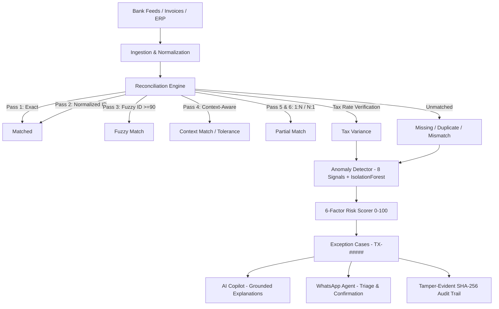

# TaxPulse AI — Autonomous Tax Reconciliation & Compliance Intelligence

> Autonomous B2B fintech tax reconciliation, anomaly detection, risk scoring, multi-tenant RBAC, and AI-grounded dispute copilot with interactive WhatsApp triage.

[](scripts/test_all.sh)
[](frontend)
[](https://python.org)
[](frontend)

---

## 1. Quickstart (2 Minutes)

### Option A: Local Development (Python + Vite)
```bash
# 1. Clone & Setup Backend
cd backend
python -m venv venv
# On Windows: venv\Scripts\activate | On Unix: source venv/bin/activate
pip install -r requirements.txt

# 2. Reset and seed canonical demo database
cd ..
python scripts/demo_reset.py

# 3. Start Backend API (Port 8000)
cd backend
uvicorn app.main:app --reload --port 8000

# 4. In a separate terminal, start Frontend (Port 5173)
cd frontend
npm install
npm run dev
```
Open [http://localhost:5173](http://localhost:5173) in your browser.

---

### Option B: Docker Compose (All-in-One)
```bash
docker compose up --build
```
Open [http://localhost:8000](http://localhost:8000) for the unified SPA + API service.

---

## 2. Architecture & Pipeline



---

## 3. Canonical Demo Walkthrough: Case TX-10482

TaxPulse AI includes a deterministic synthetic dataset seeded with 105 invoices and 12 injection categories designed to demonstrate enterprise tax discrepancy resolution:

1. **The Scenario**:
   - **Vendor**: ABC Supplies (GSTIN-ABC001, prior dispute count: 2)
   - **Invoice**: `INV-2048` for **INR 100,000.00** (Taxable Subtotal: INR 97,500.00)
   - **Recorded Tax**: **INR 18,000.00**
   - **Statutory Rate**: 18% GST (Expected Tax: `97,500 * 0.18` = **INR 17,550.00**)
   - **Tax Variance**: **INR 450.00 over-recorded tax liability**.

2. **Resolution Lifecycle**:
   - **Step 1**: Reconciliation engine flags status `TAX_VARIANCE` with INR 450.00 variance.
   - **Step 2**: Anomaly engine flags `TAX_DEVIATION` outlier signal.
   - **Step 3**: 6-Factor Risk Scorer computes composite score of **62.00 (HIGH)**:
     - Mismatch Severity: `15.00 / 25.00`
     - Financial Exposure: `15.00 / 25.00`
     - Tax Impact: `10.00 / 20.00`
     - Anomaly Score: `12.00 / 15.00`
     - Vendor History: `5.00 / 10.00`
     - Recurrence: `5.00 / 5.00`
   - **Step 4**: Case `TX-10482` auto-created in `OPEN` state.
   - **Step 5**: AI Copilot analyzes discrepancy with strict zero-hallucination grounding.
   - **Step 6**: WhatsApp alert dispatched to Reviewer phone number.
   - **Step 7**: Reviewer replies `EXPLAIN TX-10482` -> receives instant AI diagnosis.
   - **Step 8**: Reviewer replies `REVIEW TX-10482` -> bot returns 10-minute confirmation challenge.
   - **Step 9**: Reviewer replies `CONFIRM TX-10482` -> case transitions to `IN_REVIEW`.
   - **Step 10**: SHA-256 immutable audit chain logs every transition.

---

## 4. Test Matrix & Synthetic Verification

All tests run deterministically via:
```bash
bash scripts/test_all.sh
```

### Measured Precision & Recall on Synthetic Dataset:
```
Label                | Expected Status        | TP   | Precision  | Recall     | F1-Score  
----------------------------------------------------------------------------------------
clean                | MATCHED                | 56   | 80.00%     | 100.00%    | 88.89%    
many_to_one          | PARTIAL_MATCH          | 2    | 50.00%     | 100.00%    | 66.67%    
one_to_many          | PARTIAL_MATCH          | 2    | 50.00%     | 100.00%    | 66.67%    
id_variation         | MATCHED                | 8    | 11.43%     | 100.00%    | 20.51%    
amount_mismatch      | MISMATCH               | 6    | 54.55%     | 100.00%    | 70.59%    
within_tolerance     | MATCHED_WITH_TOLERANCE | 4    | 100.00%    | 100.00%    | 100.00%   
date_mismatch        | MISMATCH               | 5    | 45.45%     | 100.00%    | 62.50%    
tax_discrepancy      | TAX_VARIANCE           | 6    | 100.00%    | 100.00%    | 100.00%   
missing_payment      | MISSING                | 5    | 100.00%    | 100.00%    | 100.00%   
vendor_spike         | MATCHED                | 3    | 4.29%      | 100.00%    | 8.22%     
unusual_large        | MATCHED                | 3    | 4.29%      | 100.00%    | 8.22%     
duplicate            | DUPLICATE              | 5    | 100.00%    | 100.00%    | 100.00%   
----------------------------------------------------------------------------------------
MACRO AVERAGE        | --                     | --   | 58.33%     | 100.00%    | 66.02%    
```
*Disclaimer: Evaluated on synthetic injected dataset with fixed seed 42. Real-world precision and recall may differ.*

---

## 5. Security & Enterprise Compliance

- **Row Level Security (RLS)**: Migration `d182e951d200` enables RLS on all 18 PostgreSQL tables, denying direct PostgREST / anon access while maintaining backend service connections.
- **Monetary Integrity**: All financial calculations use Python `Decimal` and PostgreSQL `NUMERIC(18,2)`. No floating-point math is used for currency.
- **Secret Redaction**: Request middleware automatically strips and redacts secrets, tokens, and authorization headers from logs.
- **Role-Based Access Control (RBAC)**: Strict role hierarchy (`ADMIN` > `ACCOUNTANT` > `REVIEWER` > `VIEWER`) enforced across all case state transitions.
- **Webhook Security**: Inbound Meta Cloud API webhooks verify `X-Hub-Signature-256` HMAC-SHA256 signatures with constant-time comparison.
- **CSV Injection Prevention**: Export endpoints sanitize formula triggers (`=`, `+`, `-`, `@`, `\t`, `\r`) before streaming tabular files.

---

## 6. License
Internal Enterprise License — TaxPulse AI.
